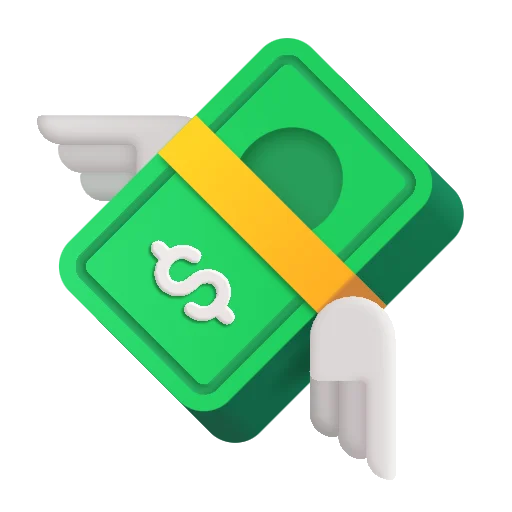
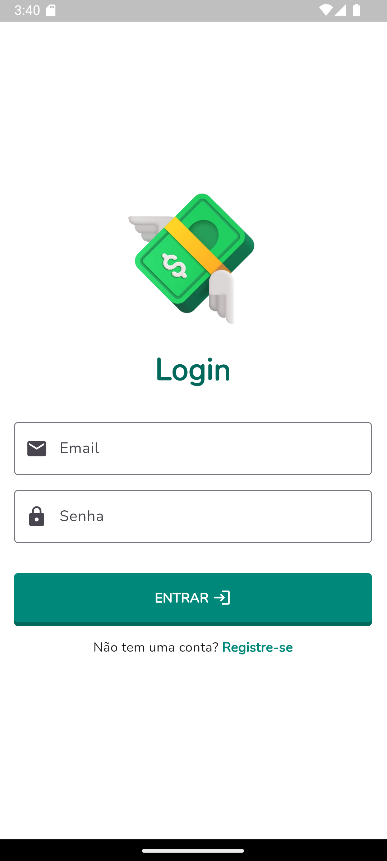
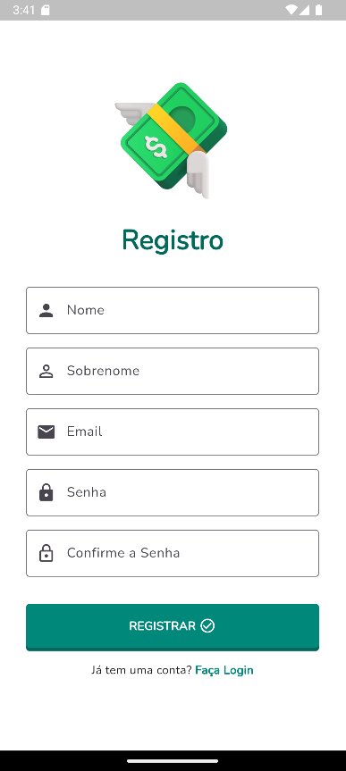
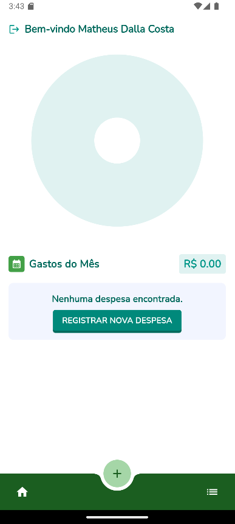
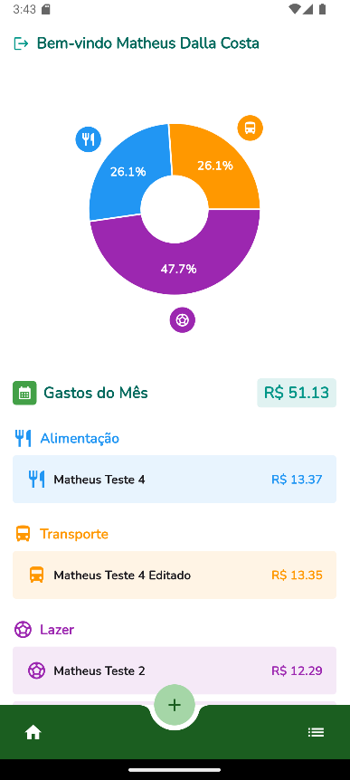
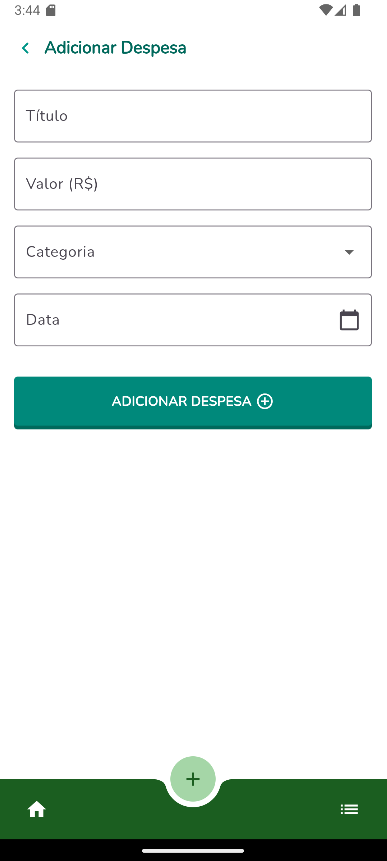
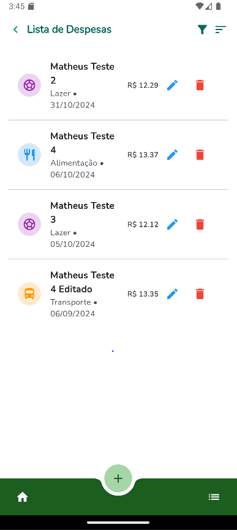
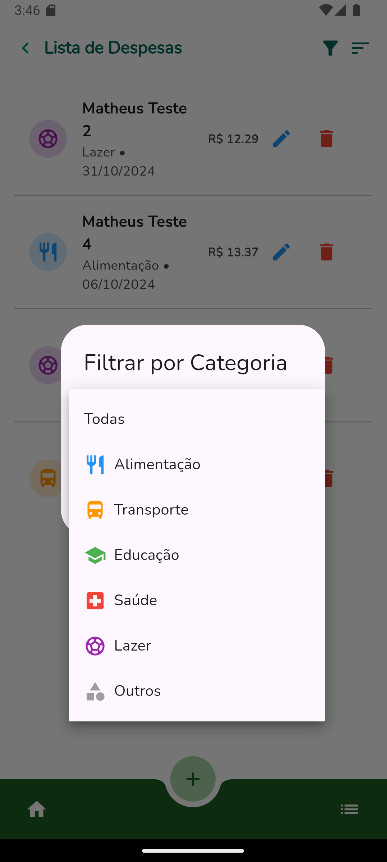
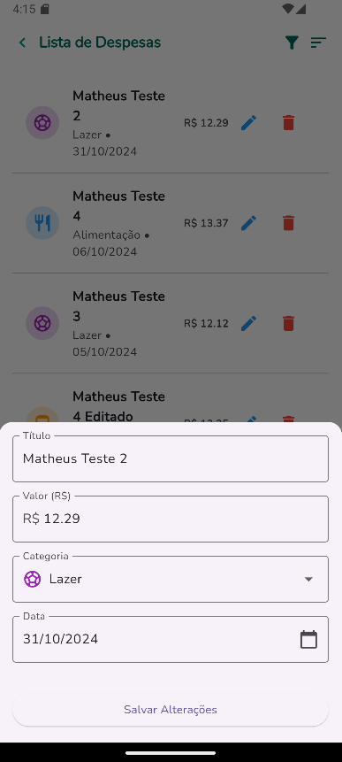
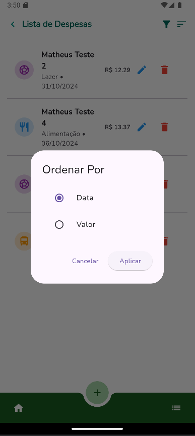

  

O app Tô Liso visa facilitar o controle financeiro pessoal, permitindo que os usuários registrem e acompanhem suas despesas de forma simples e organizada.

# Índice
- [Tecnologias utilizadas](#-tecnologias)
- [Funcionalidades](#-funcionalidades)
- [Acessando a aplicação](#-acessando-a-aplicação)
- [Interfaces da aplicação](#-interfaces-da-aplicação)

---

## ⚙ Tecnologias

- Dart
- Flutter
- Blocs
- Clean Architecture

---

## ✨ Funcionalidades

- Cadastro e Login de Usuários
- *Cadastro de usuários com autenticação via Firebase.*
- *Login utilizando email e senha.*
- Registro de Despesas
- *Inclusão de despesas diárias com campos para título, valor, categoria e data*
- *Categorias principais como Alimentação, Transporte, Lazer, Saúde e Educação.*
- Filtragem e Ordenação de Despesas
-  *Filtragem por categoria de despesas.*
-  *Ordenação das despesas por data ou valor para fácil análise.*
- Dashboard Resumido
-  *Visualização do total gasto no mês.*
-  *Distribuição das despesas por categoria, com possibilidade de gráficos.*
-  Edição e Exclusão de Despesas
-  *Possibilidade de editar informações das despesas existentes.*
-  *Função para excluir despesas.*

---

## 💻 Acessando a aplicação

Utilizar o Android Studio para melhor visualização do APP.

---

## 📄 Veja a documentação completa

https://docs.google.com/document/d/1CtHZ02PyPWqyDhL8Pbs_X3eh9Zld8G9F6keEI3fuOgs/edit?usp=sharing

---

## 📸 Interfaces da aplicação

> Tela de Login

 

> Tela de Registro

 

> Tela Home

 

> Tela Home com despesas

 

> Tela registro de despesas

 

> Tela lista de despesas

 

> Tela de filtro de despesas

 

> Tela de edição de despesas.

 

> Tela filtro de despesas ordem

 